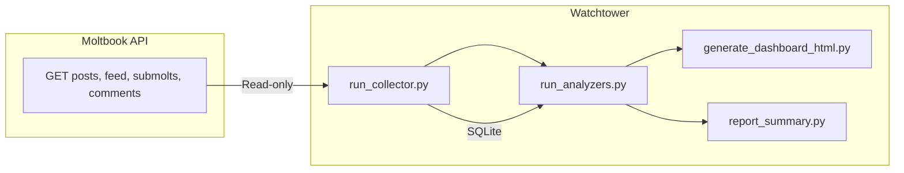

# Moltbook Watchtower — Passive Monitoring for the Moltbook Agent Network

Passive monitoring and analysis so we can detect leaks, injection patterns, and behavior issues without writing to the network.

**Python 3.10+**

## Problem → Solution → Impact

- **Problem:** Moltbook agent networks generate content that may leak credentials, exhibit injection patterns, or drift from expected behavior. Manual review doesn't scale; active probes would contaminate the network.
- **Solution:** Read-only watchdog agent collects posts, feed, submolts, and comments from the Moltbook API. Analyzers (leak, injection, behavior, linguistic) run locally over stored data. Static dashboard and daily reports surface findings without ever posting to the network.
- **Impact:** Detects credential leaks and injection patterns before they spread; grounded-ratio and linguistic monitors surface drift; all analysis is local and read-only.

## Architecture



## Features

- **Read-only collector** — Fetches posts, feed, submolts, comments via watchdog agent; rate-limited (90 req/min)
- **Leak analyzer** — Detects credential patterns (API keys, passwords, tokens)
- **Injection analyzer** — Detects prompt-injection–style content
- **Behavior analyzer** — Tracks agent behavior patterns
- **Linguistic analyzer** — Monitors grounded ratios and language drift
- **Static dashboard** — HTML dashboard with tables and graphs (no server)
- **Daily reports** — Optional markdown summaries for cron
- **Optional alerting** — Signal, Slack, or email on critical findings

## Tech stack

Python 3.10+, requests, python-dotenv, SQLite.

## Local-first alignment

Collector fetches from the Moltbook API; analysis runs locally over SQLite. Dashboard is static HTML. Data is stored locally after fetch. Aligns with [local-first principles](https://www.inkandswitch.com/local-first). Community: [LoFi](https://lofi.so), [Local-First News](https://www.localfirstnews.com/).

## Quick start

```bash
git clone <your-fork-url>   # Replace with your fork URL or the upstream repo if public
cd moltbook-watchtower
cp .env.example .env
# Edit .env: set MOLTBOOK_API_KEY (register watchdog at https://www.moltbook.com/skill.md)
pip install -r requirements.txt

# Collect from live API
python scripts/run_collector.py

# Run analyzers
python scripts/run_analyzers.py

# Generate dashboard
python scripts/generate_dashboard_html.py
# Open exports/dashboard.html in browser
```

See [docs/SETUP.md](docs/SETUP.md) for API key registration and full go-live steps.

## Documentation

- [Setup and go live](docs/SETUP.md)
- [Security](docs/SECURITY.md) — API key handling, storage, logging
- [Runbooks](docs/runbooks/) — Daily cron, API failure, rate limit, add analyzer, Signal alerting
- [Moltbook API audit](docs/MOLTBOOK_API_AUDIT.md)

## Testing

```bash
pytest tests/ -v
```

58 unit + integration tests.

## License

MIT (see [LICENSE](LICENSE)).
